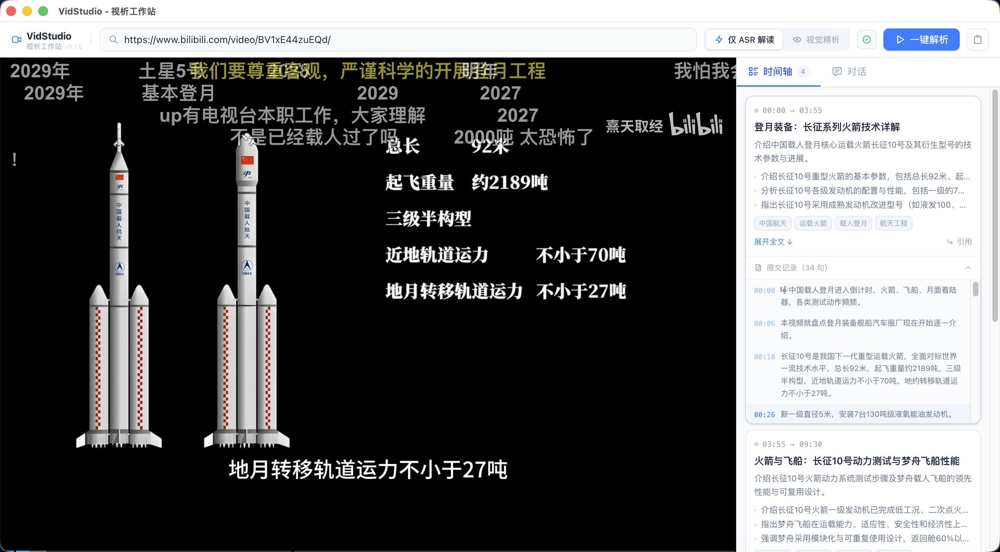

# VidStudio 视析工作站

> 粘贴 B 站链接，自动提炼视频要点，生成可跳转时间轴摘要，并支持 AI 问答 — 解析 30 分钟视频费用约 ¥0.03

 


---



---

## 简介

VidStudio 视析工作站是一款基于 Electron 的桌面应用，内置 B 站视频播放器与 AI 解析引擎（VidEngine 视析引擎）。输入视频链接后，自动提取字幕或进行语音转文字，通过语义分块与 LLM 结构化处理，生成带时间轴的知识摘要。解析完成后可在对话面板中与视频内容自由问答。

**核心优势：全链路低成本。** ASR 和 Embedding 使用硅基流动免费额度，视觉理解使用智谱 GLM-4V 免费额度，LLM 使用 DeepSeek 官方 API（deepseek-chat 输入 ¥2 / 输出 ¥3，每百万 tokens），解析一部 30 分钟视频的综合费用约 ¥0.03。

---

## 低成本方案

| 功能 | 模型 | 平台 | 费用 |
|------|------|------|------|
| ASR 语音转文字 | SenseVoiceSmall | [硅基流动](https://siliconflow.cn) | 免费额度覆盖 |
| Embedding 向量 | BAAI/bge-m3 | 硅基流动 | 免费额度覆盖 |
| 视频视觉理解（可选） | GLM-4V-Flash | [智谱 AI](https://open.bigmodel.cn) | 免费额度覆盖 |
| 结构化摘要 / 对话 LLM | deepseek-chat | [DeepSeek](https://platform.deepseek.com) | 输入 ¥2（缓存命中 ¥0.2）/ 输出 ¥3，每百万 tokens |

> **典型费用估算（30 分钟有字幕视频，约 13 个语义分块）**
>
> | 项目 | tokens | 单价 | 小计 |
> |------|-------:|------|-----:|
> | 输入 · 缓存命中（系统 Prompt 复用） | ≈ 5,200 | ¥0.2 / M | ¥0.001 |
> | 输入 · 缓存未命中（各段原文） | ≈ 6,500 | ¥2 / M | ¥0.013 |
> | 输出（结构化摘要） | ≈ 3,900 | ¥3 / M | ¥0.012 |
> | **合计** | | | **≈ ¥0.03** |
>
> 无字幕时需 ASR 转录，使用硅基流动免费额度，不额外计费。

---

## 功能特色

### 视频解析

- **智能字幕优先**：优先下载 B 站官方字幕，无字幕时自动回退至 SenseVoiceSmall ASR 转录，零额外成本
- **语义分块**：基于 TextTiling 算法与 BAAI/bge-m3 Embedding，按语义边界而非固定时长切分片段
- **自适应粒度**：根据视频时长自动调整分块参数——短视频细粒度，2 小时以上长视频粗粒度，保证每段信息密度均匀
- **结构化输出**：每个时间段生成标题、一句话总结、核心观点列表、话题标签、逐句原文记录
- **视觉理解（可选）**：GLM-4V 对关键帧进行 6×6 网格分析，将视觉信息融入摘要（「视觉精析」模式）
- **流式进度**：解析过程实时输出日志，悬停展开详细进度

### 时间轴面板

- 卡片式展示所有时间段，点击时间戳精准跳转视频播放位置
- 卡片支持展开/折叠：默认显示标题（2 行）、总结（2 行）、核心观点（3 条），按需展开全文
- 原文记录可折叠，逐句点击跳转对应时间点
- 每个片段支持一键**引用到对话**，将摘要内容作为问题上下文

### 对话面板

- 基于视频完整时间轴构建系统 Prompt，回答有完整视频内容作为背景
- **引用片段**：点击时间轴卡片「引用」按钮，自动携带片段标题、总结、核心观点、原文片段（前 5 句）
- **流式渲染**：DeepSeek SSE 流输出，token 级实时显示，带闪烁光标动画
- **Markdown 渲染**：支持标题层级、有序/无序列表、行内代码、代码块、表格、引用块等
- 未完成解析时自动禁用输入，解析新视频时自动清空历史对话

### 播放器

- 内嵌 B 站 WebView，自动触发网页全屏，沉浸式观看
- 启动时自动从本机 Edge / Chrome 导入 B 站登录 Cookies，支持高画质、大会员内容播放

---

> **平台说明**：目前仅在 macOS 上完整测试，Windows 与 Linux 理论上可运行但未经验证，如遇问题欢迎提 Issue。

## 环境要求

| 运行时 | 最低版本 | 推荐版本 |
|--------|---------|---------|
| Node.js | 18.0 | 20 LTS / 22 LTS |
| npm | 9.0 | 随 Node.js 附带 |
| Python | 3.10 | 3.11 / 3.12 |

---

## 快速开始

### 1. 克隆仓库

```bash
git clone https://github.com/kongkongisme/vid-studio.git
cd vid-studio
```

### 2. 安装前端依赖

```bash
npm install
```

### 3. 安装 Python 依赖

推荐使用 conda 创建独立虚拟环境：

```bash
conda create -n vid-engine python=3.11 -y
conda activate vid-engine
cd vid-engine
pip install -r requirements.txt
cd ..
```

> 如未安装 conda，可改用 venv：
> ```bash
> cd vid-engine
> python3 -m venv .venv
> source .venv/bin/activate        # Windows: .venv\Scripts\activate
> pip install -r requirements.txt
> cd ..
> ```

### 4. 配置 API Key

```bash
cd vid-engine
cp .env.example .env
```

编辑 `vid-engine/.env`，填入对应平台的 API Key：

```env
# 必填 — 硅基流动（ASR 语音转文字 + Embedding）
# 注册：https://siliconflow.cn
SILICONFLOW_API_KEY=sk-xxxxxxxxxxxxxxxx

# 必填 — DeepSeek（LLM 结构化摘要 + 对话）
# 注册：https://platform.deepseek.com
DEEPSEEK_API_KEY=sk-xxxxxxxxxxxxxxxx

# 可选 — 智谱 AI（GLM-4V 视觉理解，开启「视觉精析」模式时需要）
# 注册：https://open.bigmodel.cn
ZHIPUAI_API_KEY=xxxxxxxxxxxxxxxx
```

### 5. 启动应用

```bash
npm run dev
```

---

## 打包发布

```bash
npm run build:mac    # macOS (.dmg)
npm run build:win    # Windows (NSIS 安装包)
npm run build:linux  # Linux (AppImage / deb / snap)
```

产物位于 `dist/` 目录。

---

## 使用说明

1. **粘贴链接**：在顶部输入框粘贴 B 站视频链接（支持 `BV` 号及完整 URL）
2. **选择解析模式**
   - `仅 ASR 解读`：纯文字解析，速度快，仅需硅基流动 + DeepSeek
   - `视觉精析`：额外分析视频画面，摘要更准确，需要智谱 API Key，耗时略长
3. **点击「一键解析」**：等待进度完成（通常 1～10 分钟，取决于视频时长与网络）
4. **浏览时间轴**：在右侧面板查看结构化摘要，点击时间戳跳转播放，点击「引用」带入对话
5. **对话问答**：切换到「对话」Tab，直接输入问题或引用片段后提问

---

## 架构概览

```
┌──────────────────────────────────────────────────────┐
│                    Electron 应用                      │
│                                                      │
│  ┌─────────────────┐  IPC  ┌──────────────────────┐ │
│  │   Vue 3 渲染进程  │◄────►│     主进程 (Node.js)  │ │
│  │  · 时间轴面板    │      │  · IPC 路由           │ │
│  │  · 对话面板      │      │  · DeepSeek 流式请求  │ │
│  │  · WebView       │      │  · Cookie 导入管理    │ │
│  └─────────────────┘      └──────────┬───────────┘ │
│                                       │ spawn       │
│                                       ▼             │
│                            ┌──────────────────────┐ │
│                            │  VidEngine 视析引擎   │ │
│                            │   (vid-engine)        │ │
│                            └──────────────────────┘ │
└──────────────────────────────────────────────────────┘
```

### Python 解析流程

```
输入 URL
  │
  ├─ [1] 获取视频元信息（yt-dlp）
  │
  ├─ [2] 并行处理
  │    ├─ 字幕下载（优先）/ ASR 转录（无字幕时回退，硅基流动）
  │    └─ 视频视觉理解（可选，GLM-4V 全局关键帧网格分析）
  │
  ├─ [3] 语义分块
  │    └─ TextTiling + BAAI/bge-m3 Embedding
  │       自适应窗口参数（按视频时长动态调整）
  │
  ├─ [4] LLM 结构化处理（DeepSeek，多路并行）
  │    └─ 每段 → 标题 / 一句话总结 / 核心观点 / 话题标签
  │
  └─ [5] 输出 Markdown 时间轴文件
```

---

## 优化亮点

### 成本控制

| 优化点 | 说明 |
|--------|------|
| 字幕优先 | 有官方字幕时完全跳过 ASR，零 API 消耗 |
| Embedding 磁盘缓存 | 相同文本只调用一次，基于 SHA256 索引，重复运行零额外费用 |
| 断点续跑 | `--resume` 参数从上次中断的块继续，不重复消费 LLM tokens |
| 免费模型优先 | ASR、Embedding、视觉理解均优先使用免费额度模型 |

### 性能

| 优化点 | 说明 |
|--------|------|
| 并行流水线 | 字幕获取与视觉理解并行，LLM 结构化多路并行 |
| ASR 自动分片 | 大音频按 20MB / 20 分钟自动切割并行上传 |
| 流式输出 | 对话 LLM 使用 SSE 流，首字延迟低 |

### 容错降级

| 失败场景 | 降级策略 |
|---------|---------|
| 字幕不存在 | 自动切换 ASR 转录 |
| 语义分块失败 | 降级为固定时长分块 |
| LLM 调用失败 | 3 次自动重试，最终降级为原始字幕预览 |
| 视觉理解失败 | 静默跳过，不影响文字解析流程 |

---

## 项目结构

```
vid-studio/
├── src/
│   ├── main/index.ts          # Electron 主进程：IPC、Cookie、DeepSeek 流式请求
│   ├── preload/index.ts       # IPC 桥接层（contextBridge）
│   └── renderer/src/
│       └── App.vue            # 主界面：时间轴、对话、WebView 播放器
└── vid-engine/                # VidEngine 视析引擎（Python）
    ├── main.py                # CLI 入口
    ├── requirements.txt       # Python 依赖
    ├── .env.example           # API Key 配置示例
    └── src/
        ├── pipeline.py            # 主流程编排
        ├── downloader.py          # yt-dlp 封装
        ├── asr.py                 # SenseVoiceSmall 语音转文字
        ├── embedder.py            # BAAI/bge-m3 向量生成 + 磁盘缓存
        ├── llm.py                 # DeepSeek 结构化处理
        ├── video_understanding.py # GLM-4V 关键帧分析
        ├── cache.py               # Embedding 缓存 + 断点续跑
        └── segmenter/
            ├── semantic.py        # TextTiling 语义分块（主路径）
            └── timeline.py        # 固定时长分块（降级路径）
```

---

## 常见问题

**Q：解析时报 `未找到 Python 环境`？**
确认 `python3` 命令可用，或在系统 PATH 中添加 Python 安装路径。Windows 用户注意安装时勾选「Add to PATH」。

**Q：视频没有字幕，ASR 很慢？**
SenseVoiceSmall 为云端 API，速度取决于网络和硅基流动服务器负载。长视频已自动分片并行处理。

**Q：对话时提示「对话 API 不可用，请重启应用」？**
修改 preload 脚本后，electron-vite 需完整重启（`Ctrl+C` 后重新执行 `npm run dev`）才能加载新的预加载脚本。

**Q：B 站登录状态未导入？**
确保在 Edge 或 Chrome 中已登录 B 站，重启应用后会自动重新读取 Cookies。

---

## License

[MIT](LICENSE)
